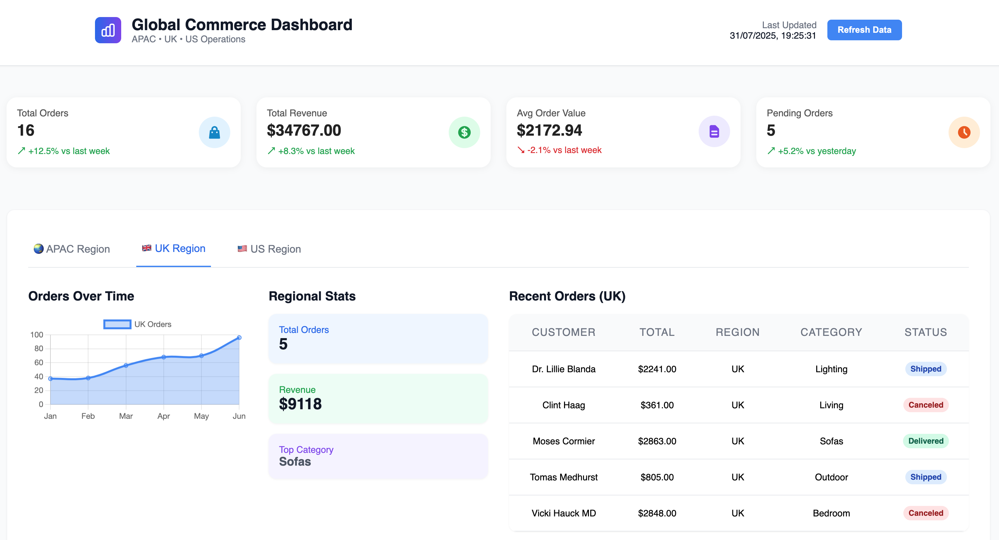
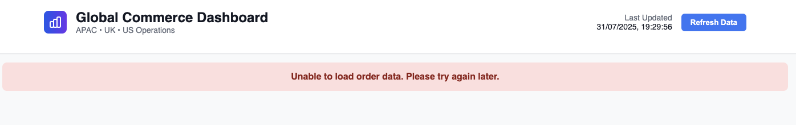

# 🌍 Global Commerce Dashboard (POC)

A real-time, responsive React + TypeScript dashboard designed for office display screens. This dashboard auto-rotates between APAC, UK, and US regional data and refreshes every hour to display live commerce metrics.

---

## 📸 Dashboard Preview




---

## ✨ AI Prompts Used

These are the **exact** prompts used to build the POC:

- `Create a Vite React TypeScript CSS module project based on: User Story "As an employee, I want to see the orders from our three separate commerce instances on one dashboard that I can view on the office display." ...`
- `For the order, I want to add in category is: Sofas, Living, Dining, Bedroom, Outdoor, Rugs, Lighting, payment method is: Credit Card, PayPal, Zip now, pay later, for the status, add in canceled, for each item, i want in the format of: Jasper Modular Sofa with Chaise, 2860mm W | Package 13, Qty1, $4,424, View Details: BaxterBaxter GraniteSeat CushionMemory FoamTimber Veneer Shelf 1: 104cmNatural Oak - Light & Charge ShelfTimber Veneer Shelf 2: 78cmSmoked Oak - Light & Charge ShelfLegsStandard Black Fixed LegKingGuard® Fabric ProtectionYes, add KingGuard® Fabric Protection`
- `Use Promise.All to fetch all the orders`
- `In my dashboard, because it will show in the office display, so I am thinking we should show 1. Global Overview(this month): Key metrics cards showing total orders, revenue, average order value, and pending orders across all regions 2.Regional Tabs: Switch between APAC, UK, and US regions to view specific data for each operation. including total order, revenue, top sales country, and add a line chart showing order trends over time for each region using Chart.js.(from Jan to June). 3. Order Tables
: Recent orders with customer details, locations, amounts, and status indicators for each region. Since it's a dashboard, please make sure it has a professional design, a Clean, modern interface with proper spacing, colours, and a responsive layout that works on all devices.
`
- `Would you like me to generate the entire project as a ZIP file with this professional dashboard (including Chart.js integration and responsive UI) so you can run it instantly? - Yes`
- `The main component is ready, now adjust the styles. I went to Canva AI, typed in I have to create an e-commerce dashboard to show info about orders from three commerce instances representing our APAC, UK, and US operations. Then get a design. 1. Then paste the dashboard header to ChatGPT, say I want the same style. 2. I want my global metrics to have the same styles as. 3. Very good, now I want my regional tabs followers to have the same styles as…. 4. Very good, now I want my recent orders to have the same styles as…. 5. Responsive in different screen sizes. 6. I want to reorganise my code structure, inside main, should have metriccards, regionOverviewWrapper, regionOrders. 7. The header does not fully take up all the page width.
- `Good, now styles all done, now I want the data to make more sense, instead of top country, I want to show top sales category`
- `Now, because it will show in the office display, instead of manually clicking each region, it shows the corresponding region. Can it show different regions automatically without clicking the button - Auto-Switch Regions?`
- `For the refresh data button, I am thinking it's for office display, maybe automatically refresh every hour, when refreshing data, I want the button to be disabled`
- `When refreshing, instead of showing loading, I want to show a spinner in the centre of the content`
- `For my orderTrendChart, only when my mouse hovers will it show data; if for office display, it can automatically show data without mouse movement. Tried some approach, not working as expected.
- `Add error handling when fetching data goes wrong`
- `I am thinking reorganise my components, so all of them can fit in one small shorter screen, now i want breakpoint, when screen size is <768, regions display column, gird and orders take up 100%, or i don't say 768, it auto detect if grid and orders overlap, then display column`

---

## 🧠 Technical Design & Reasoning

- **Optimised for Office Displays:**

  - Auto-refreshes every hour.
  - Automatically cycles through regions every 5 seconds.
  - Prioritises visual clarity over interaction.

- **High-Level Metrics First:**

  - Displays **Total Orders**, **Total Revenue**, **Average Order Value**, and **Pending Orders**.
  - Metrics are updated every hour automatically.
  - Manual refresh available with visual loading state.

- **Per-Region Overview:**

  - Automatically rotates through **APAC**, **UK**, **US** every 5 seconds.
  - Displays:
  - Orders Over Last 6 Months (trend line chart)
  - Total Orders
  - Total Revenue
  - Top Sale Category

- **Responsive UI:**

  - Uses Flexbox and media queries.
  - Sections stack vertically on smaller screens.

- **Componentization:**

  - Each UI element (cards, charts, tabs, tables) is modular for clarity and reuse.
  - File structure:

  ```plaintext
  src/
  ├── components/
  │   ├── HeaderBar/
  │   ├── MetricCards/
  │   ├── OrderTable/
  │   ├── OrderTrendChart/
  │   ├── RegionTabs/
  │   └── StatCard/
  ├── data/
  │   └── mockOrders.ts
  ├── pages/
  │   └── Dashboard/
  ├── App.tsx
  ├── main.tsx
  ├── index.css
  ```

- **Error Handling:**

  - Friendly error banner when data fails to load.

- **Auto-Refresh with `Promise.all`:**
  - Simultaneously fetches regional data efficiently.

---

## 🚀 Setup & Run Instructions

### 📦 Prerequisites

- Node.js ≥ `v20.10.0`
- npm ≥ `10.4.0`

### 🛠️ Install & Run

```bash
git clone https://github.com/Jocelyn166/global-commerce-dashboard.git
cd global-commerce-dashboard
npm install
npm run dev
```

---

## 📋 Assumptions Made

- Mock-generated data simulates real backend calls.
- Displayed on office monitors — prioritises auto-rotation and read-only view.
- No authentication or user interaction needed.

---

## 🤖 Reflection on AI Usage

### ✅ How AI Helped

- Generated reusable components.
- Structured file/folder layout.
- Assisted with:
  - Auto-refresh and region-switching logic
  - Responsive CSS module layout
  - Mock data creation

### ⚠️ Where Human Input Was Needed

- Adjusting chart UI/padding
- Fixing TypeScript edge cases
- Fine-tuning mobile responsiveness
- Manual test and layout adjustments

> **AI contributed ~70–80% of the initial build effort.**
